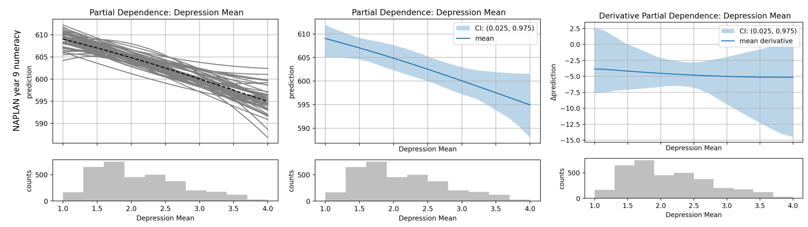

Causal Inspection
=================

A Scikit-learn inspired inspection module for *causal models*.


Plots generated using this library, these are an example of how partial 
dependence plots can be used for visualising causal effect, see [3] for 
more details.<br><br>

Using machine learning for (observational) causal inference is distinct from
how machine learning is used for prediction. Typically a process like the
following is undertaken for an analysis,

1. Formulate causal assumptions into a graph representing the causal
   relationships in the system under study. Run the "do calculus" algorithm on
   this graph to ascertain if the causal effect of interest is identifiable
   with the current data and assumptions.

2. If the causal effect is identifiable, construct an estimator, e.g. a machine
   learning model, of the system, and fit this estimator to the available data.

3. Perform the desired "intervention" on the machine learning model, and
   measure or visualise the resulting effect.

This software library is primarily concerned with the third stage - visualising
and reporting on the estimated causal effect. This is done by extending on the
`inspection` module within scikit-learn. In particular we offer customised and
extended permutation importance plotting functionality, partial dependence
plotting for continuous and discrete treatment effects [1, 2], as well as
methods for estimating binary and categorical treatment effects.

We have implemented (some) of the visualisation and quantification methods
discussed in [1] and [2]. Please see the [Example
Usage](https://github.com/gradientinstitute/causal-inspection#example-usage)
section for more details.


Installation
------------

To just install the cinspect package, clone it from github and then in the
cloned directory,

    pip install .

To also install the extra packages required for development and simulation,
install in the following way,

    pip install -e .[dev]

You may have to escape some of the characters in this command, e.g. `pip
install -e .\[dev\]`. You can then run the simulations in the `simulations`
directory.


Modules
-------

- `cinspect`: the tools for inspecting estimated causal effects.
- `simulations`: a data generation class and some simulations for demonstrating 
  and testing the tools.


Example Usage
-------------

We strive for an interface that is familiar to those who use scikit-learn. In
particular we have emulated the interface to the
[`cross_validate`](https://scikit-learn.org/stable/modules/generated/sklearn.model_selection.cross_validate.html)
function.

The advantage of this interface is that you can use scikit-learn pipeline
estimators that incorporate column transformers, imputation transformers etc
into your cross validation or sampling loop. This allows for as much of the
modelling pipeline as possible to undergo validation and/or uncertainty
sampling. Below is an example of how you would use this library to generate
partial dependence plots with confidence intervals, and permutation importance
plots.


```python
# X is a pandas dataframe with a column labelled "T" for treatment

# Model, with built in model selection
model = GridSearchCV(
    GradientBoostingRegressor(),
    param_grid={"max_depth": [1, 2, 3]}
)

# Casual estimation - partial dependence and permutation importance
pdeval = PartialDependanceEvaluator(feature_grids={"T": "auto"})
pieval = PermutationImportanceEvaluator(n_repeats=5)

# Bootstrap sample the data, re-fitting and re-evaluating the model each time.
# This will run the GridSearchCV estimator, so thereby performing model
# selection within each bootstrap sample.
bootstrap_model(best_model, X, Y, [pdeval, pieval], replications=30)

# Plot results
pdeval.get_results(mode="interval")  # PD plot with confidence intervals
pdeval.get_results(mode="derivative")  # Derivative PD plots, see [2]
pieval.get_results(ntop=5)  # Permutation importance, show top 5 features

plt.show()
```


References
----------

[1] Q. Zhao and T. Hastie, "Causal Interpretations of Black-Box Models,"
Journal of Business & Economic Statistics, vol. 39, no. 1, pp. 272–281, Jan.
2021, doi: 10.1080/07350015.2019.1624293.

[2] T. R. Cook, G. Gupton, Z. Modig, and N. M. Palmer, "Explaining Machine
Learning by Bootstrapping Partial Dependence Functions and Shapley Values,"
RWP, Nov. 2021, doi: 10.18651/RWP2021-12.

[3] Cárdenas, D., Lattimore, F., Steinberg, D. et al., "Youth well-being
predicts later academic success," Sci Rep 12, 2134 (2022). doi:
10.1038/s41598-022-05780-0


License
-------

Copyright 2022 Gradient Institute

Licensed under the Apache License, Version 2.0 (the "License"); you may not use
this file except in compliance with the License. You may obtain a copy of the
License at

http://www.apache.org/licenses/LICENSE-2.0

Unless required by applicable law or agreed to in writing, software distributed
under the License is distributed on an "AS IS" BASIS, WITHOUT WARRANTIES OR
CONDITIONS OF ANY KIND, either express or implied. See the License for the
specific language governing permissions and limitations under the License.
